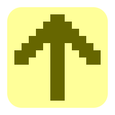

Ising
---

Isingは、簡素なイジングモデルです。
平面上で格子状に並ぶ点 (スピン) の状態の時間変化をシミュレーションしています。
状態は2値のどちらかをとるようになっており、色の違いによりそれを表現しています。
2値のうちどちらを取りやすいかはパラメータや隣接点の状態により決定されます。
パラメータを変えた時に全体で生じる絵柄がどのように変わるか、お楽しみください。

[Ising を開く](https://akimikimikimikimikimikimika.github.io/Ising/ "Ising")

[ソースコード](https://github.com/akimikimikimikimikimikimika/Ising/ "ソースコード")

## 基本

- ページをロードした直後から、イジング模型は変化していく。
- パラメータを変化させると、全体的な状態の移り変わり方にも変化が生じる。
- 状態を表示する描画方法が数種類用意されているので、ブラウザで最も的確に表示可能なレンダラーを選択して利用できる。

## メニューの内容

表示される格子の右側或いは下側に制御メニューが配置されている。以下では、このメニューの各項目の内容について説明する。

### Parameters

系の特性を決め、状態の遷移の仕方を規定する値を設定する。

- **logT** … 温度  
	一般的に値を大きくすると、周囲のスピンの影響を受けにくくなり、乱雑な無秩序状態になりやすい。逆に値を小さくすると、同じ状態が固まって生じる秩序状態になりやすい。  
	温度は対数により指定できるようになっており、秩序・無秩序の境界となる温度が 0 となるようにオフセットを取っている。つまり、 logT が正の値を取れば無秩序状態になりやすく、 logT が負の値を取れば秩序状態になりやすい。

- **H** … 外部磁場  
	通常は2つの状態のどちらも同じ確率だけ取りやすくなっており、どちらが支配的なるかは乱数次第となっているが、外部磁場を正あるいは負に加えると、どちらか一方の方がエネルギー的に取りやすくなるため、支配的な状態が決まってしまい、ちょっといた揺らぎや外場には動じなくなる。

- **J** … 影響の受け方  
	隣接状態や温度、磁場による影響の受け方を決める。
	+1 だと周囲の状態と揃えた方がエネルギー的には安定し、 0 だと周囲の状態に影響を受けず、 -1 だと周囲の状態と逆の状態をとった方がエネルギー的には安定する。
	物理的には +1 が適切な値である。

- **pixels** … ピクセル数  
	正方形領域1辺に含まれるスピンの数を指定する。なので、すべての点の数はこの2乗で与えられる。

### Controls

状態遷移の仕方を設定する。  
なるべく一定周期で状態遷移を行うことにしているが、描画の更新タイミングと合わせるために実際には最も近い `requestAnimationFrame` のフレーム更新のタイミングで状態遷移が行われる。

- **Updating**  
	状態遷移を進めるか否かを指定する。つまり、再生/一時停止ボタンである。

- **Minimum Updating Interval**  
	状態遷移を行う頻度を設定する。指定された秒数ごとに次の状態を計算して描画するように努める。　　
	しかし、描画方法によっては指定した秒数よりも長い周期で再描画を行う可能性がある。

- **Actual Interval**  
	現時点での描画更新の周期を表示します。 API の仕様上ミリ秒までの精度を持つ。

- **Animation Frames**  
	前の状態遷移から現在の状態遷移が起こるまでの間に `requestAnimationFrame` によるフレーム描画の呼び出しが何回あったかを示している。更新周期により値はある程度決まるが、描画がもたついている場合は期待される値よりも小さくなる。

### Renderer

格子を描画する方法を選択したり、描画方法のオプションを指定することができる。
以下には、搭載されている全ての描画方法と、それぞれの描画方法で対応しているオプションの指定を説明する。
開いているブラウザにおいて対応している描画方法のみが表示される。

#### WebGL / WebGL 2

`<canvas>` の WebGL コンテクストで描画する。  
OpenGL ES に準拠したラスターベースの描画を行う。

##### オプション

- Device Pixel Ratio : Adapt / Ignore  
	ディスプレイの物理ピクセル数に合わせて `<canvas />` の画像解像度を上げるか否かを設定する。  
	画像解像度が上げない場合、特に境界部で表示がぼやけることがある。

#### WebGPU

`<canvas>` の WebGPU コンテクストで描画する。  
新しい WGSL シェーダーによるラスターベースの描画を行う。

##### オプション

- Device Pixel Ratio : Adapt / Ignore  
	ディスプレイの物理ピクセル数に合わせて `<canvas />` の画像解像度を上げるか否かを設定する。  
	画像解像度が上げない場合、特に境界部で表示がぼやけることがある。

#### Canvas

`<canvas>` の 2D コンテクスト、或いは Bitmap Renderer コンテクストで描画する。ラスターベースの描画を行う。  
Bitmap Renderer では予め画像データを用意しておき、 `<canvas />` 上に表示させる。画像データは JavaScript の配列として直接用意されるため、 2D コンテクストに比べて処理が重くなりやすい。  
2Dコンテクストでは、同じ絵でも複数の描画コマンドで描く方法が考えられるが、最終的にはラスター画像であり違いが生まれないと考えて、1種類しか実装していない。

##### オプション

- Context: 2D / Bitmap Renderer  
	使用するコンテクストを変更する。

- Device Pixel Ratio : Adapt / Ignore  
	ディスプレイの物理ピクセル数に合わせて `<canvas />` の画像解像度を上げるか否かを設定する。  
	画像解像度が上げない場合、特に境界部で表示がぼやけることがある。

#### DIV CSS Painting

格子全体を単一の `
` で扱う。 CSS Painting API により `background-image: paint();` と指定された `
` の背景を 2D コンテクストの Offscreen Canvas として描画している。

#### DIV Background

格子全体を単一の `
` で扱う。各セルを単色の背景画像により描画する。  
背景画像を `background-size` と `background-position` を駆使して各セルの位置に配置する、ということを全てのセルに対して行なって格子全体を描画する。

##### オプション

- Overlap  
	セルの間に隙間が生じないように、セル同士を多少重ねて描いているが、どの程度重ねるかを定める。

- Device Pixel Ratio : Adapt / Ignore  
	ディスプレイの物理ピクセル数に合わせて計算用の座標を大きめに取るか設定する。

#### DIV ClipPath Polygon

格子全体を単一の `
` で扱う。2つの状態それぞれに対し、該当する領域を多角形として描く。  
格子全体に広げた `
` を `background-color` で状態を表す色で塗り、 `clip-path: polygon();` で指定した領域で切り抜いて実現する。  
状態を表す領域は単一の `
` に対する `::before`, `::after` 擬似要素を使って対応する。

##### オプション

- Draw: All-Cells / One-side Cells Only  
	`All-Cells` の場合、2つの状態それぞれに対して多角形を作成して表示する。 `One-side Cells Only` の場合、2つの状態のうち、セルの数が多い方を背景として、少ない方のみをその上に乗る多角形として描く。

#### DIV Shadow

格子全体を単一の `
` で扱う。セル1つ分のサイズの透明な正方形を用意し、その「影」として全てのセルを描画する。  
単一の `
` に対する `::before` 擬似要素として透明な正方形を用意する。

##### オプション

- Draw: All-Cells / One-side Cells Only  
	`All-Cells` の場合、全てのセルは影として描かれる。 `One-side Cells Only` の場合、2つの状態のうち、セルの数が多い方を背景として、少ない方のみをその上に影として描く。

#### DIV Gradient

格子全体を単一の `
` で扱う。 `linear-gradient` 或いは `conic-gradient` によるグラデーションを使って描画する。

- Linear Gradient Horizontal  
	格子全体を行ごとに分け、1つの行を横方向のグラデーションとして表現する。
- Linear Gradient Vertical  
	格子全体を列ごとに分け、1つの列を縦方向のグラデーションとして表現する。
- Conic Gradient  
	格子全体をセルが 2×2 となる領域ごとに分け、領域ごとに扇形グラデーションとして表現する。

##### オプション

- Mode: Linear Gradient Horizontal / Linear Gradient Vertical / Conic Gradient  
	グラデーションの仕方を変更する。

- Overlap  
	行/列/領域の間に隙間が生じないように、行/列/領域同士を多少重ねて描いているが、どの程度重ねるかを定める。

- Device Pixel Ratio : Adapt / Ignore  
	ディスプレイの物理ピクセル数に合わせて計算用の座標を大きめに取るか設定する。

#### DIV Grid

単一の `
` の中で、各セルに対応する `
` を配置して描く。グリッドレイアウトに従って各セルを配置する。

##### オプション

- Mode: Row Flow / Column Flow / One-sided Cells Only  
	グリッドレイアウトでの要素の配置の仕方を指定する。
	- Row Flow では、要素は横方向に左から右に流れていき、右端に達したら下の行に移動する。
	- Column Flow では、要素は縦方向に上から下に流れていき、下端に達したら右の列に移動する。
	- One-sided Cells Only では、セルの数が多い方の状態を背景の色として与え、少ない方をグリッド要素として、グリッド上の場所を直接指定して配置する。

#### DIV Flex

単一の `
` の中で、各行/列に対応する `
` をフレックスレイアウトで配置し、それぞれの行/列の中で各セルに対応する `
` をフレックスレイアウトで配置して描く。

##### オプション

- Mode: Vertical → Horizontal / Horizontal → Vertical
	フレックスレイアウトでの配置の仕方を指定する。
	- Vertical → Horizontal では、まず行を縦方向フレックスで構成して、その中でセルを横方向フレックスで配置する。
	- Horizontal → Vertical では、まず列を横方向フレックスで構成して、その中でセルを縦方向フレックスで配置する。

- Reverse outer  
	行/列の並び順を逆順にするか否かを指定します。

- Reverse inner  
	行/列の中でのセルの並び順を逆順にするか否かを指定します。

#### DIV Absolute

単一の `
` の中で、各セルに対応する `
` を配置して描く。各セルに対して上下左右の端からの距離を直接指定して位置を決定させる。

##### オプション

- Draw: All-Cells / One-side Cells Only  
	`All-Cells` の場合、全てのセルを順に配置していって描く。 `One-side Cells Only` の場合、2つの状態のうち、セルの数が多い方を背景として、少ない方のみをセルとして描く。
	
- use nth-of-type  
	`
` を選択するのに CSS セレクタの `:nth-of-type` を使用するか指定する。使用すれば効率よく要素を選んで座標を指定する。使用しない場合は、座標指定を全ての `
` に対して直接与える。

#### DIV Inline Block

単一の `
` の中で、各セルに対応する `
` を配置して描く。各セルの `
` に `display: inline-block;` を指定し、インラインテキストのようにセルを配置していく。

##### オプション

- Writing Mode: Horizontal T→B / Vertical R→L / Vertical L→R  
	CSS の `writing-mode` プロパティに対応し、横書きか縦書きか、縦書きの場合行は右から左か、左から右のどちらに続くか指定する。

- Direction: LTR / RTL  
	CSS の `direction` プロパティに対応し、テキストが左から右に流れるか、右から左に流れるか、指定する。縦書きの場合に RTL を指定すると下から上に流れる。

#### DIV Sublattices

単一の `
` の中で、副格子にあたる位置に `
` を配置して描く。  
副格子上の各点の位置には左上、右上、左下、右下の4箇所で色を塗り分けられる菱形が配置されている。  
菱形は正方形を 45° などで回転させることにより得られる。

##### オプション

- Draw as: Border / Conic Gradient  
	4箇所で色の異なる菱形を描く方法を指定する。
	- Border: `border` を使用して描く。上下左右で別々の `border-color` を指定することで構成される。
	- Conic Gradient: 扇形グラデーションで 90° ずつ別の色で塗り分けることで構成される。
	
- use nth-of-type  
	`
` を選択するのに CSS セレクタの `:nth-of-type` を使用するか指定する。使用すれば効率よく要素を選んで座標を指定する。使用しない場合は、座標指定を全ての `
` に対して直接与える。

- Layout  
	副格子の種類を選択する。副格子は2種類あるが、そのどちらを使って配置するか決定する。

- Rotation angle  
	菱形を作るのに正方形を何度回転させるか指定する。

- Rotate: per cells / whole lattice  
	回転させる単位を指定する。
	- per cells: 副格子上に配置された四角形を個別に回転させて構成する。
	- whole lattice: 予め斜めを向いた副格子を用意してそこに配置し、格子全体を回転させることで構成する。

#### Table

`<table />` 要素を起点とした表として配置する。各セルに至るまで、 `table > tbody > tr > td` という階層がある。行の階層の下にセルの階層がある構造は Div Flex の Vertical → Horizontal と同じである。

#### SVG Path

SVG により構成する。2つの状態それぞれに対し、該当する領域を `<path />` 要素を使って描く。

##### オプション

- Draw as: Fill rect / Stroke horizontal line / Stroke vertical line  
	それぞれのセルの描き方を指定する。
	- Fill rect: 全てのセルは四角形を色で塗り潰して描かれる。
	- Stroke horizontal line: 全てのセルは太さを持った横方向の線で描かれる。
	- Stroke vertical line: 全てのセルは太さを持った縦方向の線で描かれる。

- Draw: All-Cells / One-side Cells Only  
	`All-Cells` の場合、2つの状態それぞれに対して `<path />` で図形を描く。 `One-side Cells Only` の場合、2つの状態のうち、セルの数が多い方を背景として、少ない方のみをその上に乗る図形として描く。

#### SVG Polygon

SVG により構成する。2つの状態それぞれに対し、該当する領域を `<polygon />` 要素の多角形として描く。

- Draw: All-Cells / One-side Cells Only  
	`All-Cells` の場合、2つの状態それぞれに対して多角形を描く。 `One-side Cells Only` の場合、2つの状態のうち、セルの数が多い方を背景として、少ない方のみをその上に乗る多角形として描く。

#### SVG Rect / Line

SVG により構成する。2つの状態それぞれに対し、該当する領域を `<rect />` 要素や `<line />` 要素を使って描く。  
SVG Path と違う点は、全てのセルが完全に別々の要素として描かれることである。

##### オプション

- Draw as: Rect (fill) / Horizontal Line (stroke) / Vertical Line (stroke)  
	それぞれのセルの描き方を指定する。
	- Rect (fill): 全てのセルは `<rect />` による四角形を色で塗り潰して描かれる。
	- Horizontal Line (stroke): 全てのセルは `<line />` による太さを持った横方向の線で描かれる。
	- Vertical Line (stroke): 全てのセルは `<line />` による太さを持った縦方向の線で描かれる。

- Draw: All-Cells / One-side Cells Only  
	`All-Cells` の場合、2つの状態それぞれに対して `<rect />` や `<line />` で描く。 `One-side Cells Only` の場合、2つの状態のうち、セルの数が多い方を背景として、少ない方のみをその上に乗る図形として描く。

- Overlap  
	セルの間に隙間が生じないように、セル同士を多少重ねて描いているが、どの程度重ねるかを定める。

#### SVG Gradient Rect

SVG により構成する。各行/列が `<rect />` 要素に対応し、 `<linearGradient />` 要素によるグラデーションの塗り潰しでセルを描く。

##### オプション

- Mode: Horizontal Linear Gradient / Vertical Linear Gradient  
	グラデーションの仕方を変更する。
	- Horizontal Linear Gradient: 各行ごとに別々の `<rect />` 要素とし、その塗り潰しを横方向のグラデーションとして、セルを描く。
	- Vertical Linear Gradient: 各列ごとに別々の `<rect />` 要素とし、その塗り潰しを縦方向のグラデーションとして、セルを描く。

- Overlap  
	行/列の間に隙間が生じないように、行/列同士を多少重ねて描いているが、どの程度重ねるかを定める。

#### Input Checkbox / Radio

正確に似せて描画することを諦め、チェックボックスやラジオボタンにより状態を表現している。

##### オプション

- Type: Checkbox / Radio Button  
	チェックボックス / ラジオボタンのどちらにより描くか定める。

- Size  
	チェックボックス / ラジオボタンのサイズを決定する。

### Other Settings

- **RNG**  
	乱数生成源を指定する。
	- Normal: `Math.random()` から得られる乱数を使用する。
	- Crypto: 暗号学的により安全とされている `crypto.getRandomValues()` から乱数を得る。但し、このアプリケーションにおいて暗号学的に安全な乱数を使うことに特に意味はない。

- **Theme**
	アピアランス (ライト/ダーク) を設定する。

## 実装

このアプリケーションは React フレームワークを使って実装されており、 TypeScript を使用している。  
ソースコードは [`project`](project) ディレクトリに存在している。

## 旧バージョン

フレームワークを使用せずに実装した旧バージョンは [こちら](https://akimikimikimikimikimikimika.github.io/Ising/Ising.html "Ising") からアクセスできる。