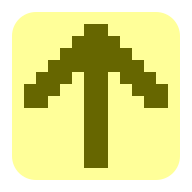

## Ising

Isingは、簡素なイジングモデルです。
平面上に並ぶスピンを持った粒子のスピンの変化をシミュレーションしています。
それぞれのスピンは、上下左右で隣接する粒子のスピンに応じて変化します。
各々のパラメータを変化させた際のスピンの様子を楽しめます。

[Ising を開く](https://akimikimikimikimikimikimika.github.io/Ising/Ising.html "Ising")

[ソースコード](https://github.com/akimikimikimikimikimikimika/Ising/ "ソースコード")

### 基本

- ページをロードした直後から、イジング模型は変化していく。
- パラメータを変化させると、全体的なスピンの移り変わり方にも変化が生じる。
- 2次元上のスピンのデータを表示するレンダラーが数種類用意されているので、ブラウザで最も的確に表示可能なレンダラーを選択して利用できる。

### パラメータ

- **T** … 温度
	一般的に値を大きくすると、周囲のスピンの影響を受けにくくなり,乱雑さが増す。
	逆に値を小さくすると、一様な模様に変化していく。

- **H** … 外部磁場
	外部磁場を正又は負に加えると、スピンが一様な方向に向き,乱雑さが減る。

- **J** … 影響の受け方
	スピンが周囲のスピンに受ける影響を示す定数である。
	+1 だと周囲のスピンに合わせるような影響を受け、 0 だと無影響で、 -1 だと周囲のスピンに背く向きに影響を受ける。
	物理的には +1 が適切な値。

- **pixels** … ピクセル数
	正方形領域1辺に含まれるスピンの数を指定する。

- **Pause** … 一時停止
	オンになっている時には状態遷移を停止させる。

### レンダラー
以下のうち、ブラウザにおいて利用可能なレンダラーのみが表示される。
表示されていても的確にレンダリングされるとは限らない。

- **WebGL**
	`<canvas>` の WebGL コンテクストで描画する。
	OpenGLシェーダーによりGPUを用いるため、パフォーマンスが向上しうる。

- **WebGPU**
	`<canvas>` の WebGPU コンテクストで描画する。
	WHLSLシェーダーによりGPUを用いるため、パフォーマンスが向上しうる。
	Safariの場合は、設定からWebGPUを有効にすることで利用可能になる。

- **Canvas 2D**
	`<canvas>` の Canvas 2D コンテクストで各セルに対応する正方形を並べて描画する。

- **CSS Paint**
	CSSで指定したデータに基づいてJavaScriptのWorkerがバックグラウンドでセルの正方形を並べて描画する。
	実験的な機能であるため、対応していないブラウザが多い。

- **DIV Background**
	`
` に全てのセルを背景画像として並べて描画する。

- **DIV Background (minimized)**
	`
` に全てのセルを背景画像として並べて描画する。まず、多い方のビットで全体一様に着色させて、少ない方のビットをその上に載せている。

- **DIV Horizontal Gradient**
	`
` に横方向のグラデーションとして描いている。行ごとに別のグラデーションにして並べている。

- **DIV Vertical Gradient**
	`
` に縦方向のグラデーションとして描いている。列ごとに別のグラデーションにして並べている。

- **DIV Grid**
	`
` をグリッドレイアウトで配置させ、各セルの背景を着色させて描画する。

- **DIV Flex VH**
	`
` を縦横それぞれにフレックスレイアウトで配置させ、各セルの背景を着色させて描画する。行ごとに縦に並べてから、セルごとに横に並べている。

- **DIV Flex HV**
	`
` を縦横それぞれにフレックスレイアウトで配置させ、各セルの背景を着色させて描画する。列ごとに横に並べてから、セルごとに縦に並べている。

- **DIV Absolute**
	`
` を各セルごとにフレーム内で絶対位置で配置させ、各セルの背景を着色させて描画する。

- **DIV Absolute (minimized)**
	`
` を各セルごとにフレーム内で絶対位置で配置させ、各セルの背景を着色させて描画する。まず、多い方のビットで全体一様に着色させて、少ない方のビットをその上に載せている。

- **DIV Table**
	`
` を使って表を組み、各々のセルの背景を着色させて描画する。

- **SVG Path Fill**
	インラインSVGにおいてパス `<path>` でビットごとに領域を塗りつぶしにより描く。

- **SVG Path Fill (minimized)**
	インラインSVGにおいてパス `<path>` で領域を塗りつぶしにより描く。まず、多い方のビットで全体一様に着色させて、少ない方のビットをその上に載せている。

- **SVG Horizontal Stroke**
	インラインSVGにおいてパス `<path>` でビットごとに領域を描く。太さを持った横方向の線の組み合わせにより描く。

- **SVG Horizontal Stroke (minimized)**
	インラインSVGにおいてパス `<path>` で領域を描く。太さを持った横方向の線の組み合わせにより描く。まず、多い方のビットで全体一様に着色させて、少ない方のビットをその上に載せている。

- **SVG Vertical Stroke**
	インラインSVGにおいてパス `<path>` でビットごとに領域を描く。太さを持った縦方向の線の組み合わせにより描く。

- **SVG Vertical Stroke (minimized)**
	インラインSVGにおいてパス `<path>` で領域を描く。太さを持った縦方向の線の組み合わせにより描く。まず、多い方のビットで全体一様に着色させて、少ない方のビットをその上に載せている。

- **SVG Rect**
	インラインSVGにおいて正方形 `<rect>` を並べて、各セルを色で塗りつぶして描画する。

- **SVG Rect (minimized)**
	インラインSVGにおいて正方形 `<rect>` を並べて、各セルを色で塗りつぶして描画する。まず、多い方のビットで全体一様に着色させて、少ない方のビットをその上に載せている。

- **SVG Horizontal Line**
	インラインSVGにおいて太さを持った横方向の線 `<line>` を並べて、各セルを描画する。

- **SVG Vertical Line**
	インラインSVGにおいて太さを持った縦方向の線 `<line>` を並べて、各セルを描画する。

### 特記事項
- JavaScript、CSSを無効にすると利用できない。
- 同じURLでそのままデスクトップでも、モバイルでも利用できる。
- Internet Explorerでは利用できない。
- iOSデバイスでは、ホーム画面にアイコンを追加すると、スタンドアロンで開く。
- iPhone X 対応。

### 注意事項
最大で 150×150 のドットの描画が可能なようにしているが、一部のレンダラーにおいては高いピクセル数でブラウザのパフォーマンスに影響を及ぼしうるので、特に 100×100 以上を試すのはなるべく控えること。

### 更新内容
- ソースコードの改良
- バグの修正
- WebGL 2 に対応 (WebGLの代わりにWebGL 2が使用される)
- WebMetal は今後Web標準になる可能性が低く、最新のブラウザでは非対応なので、削除した。
- より細かい機能に対応させたレンダラーを用意した。